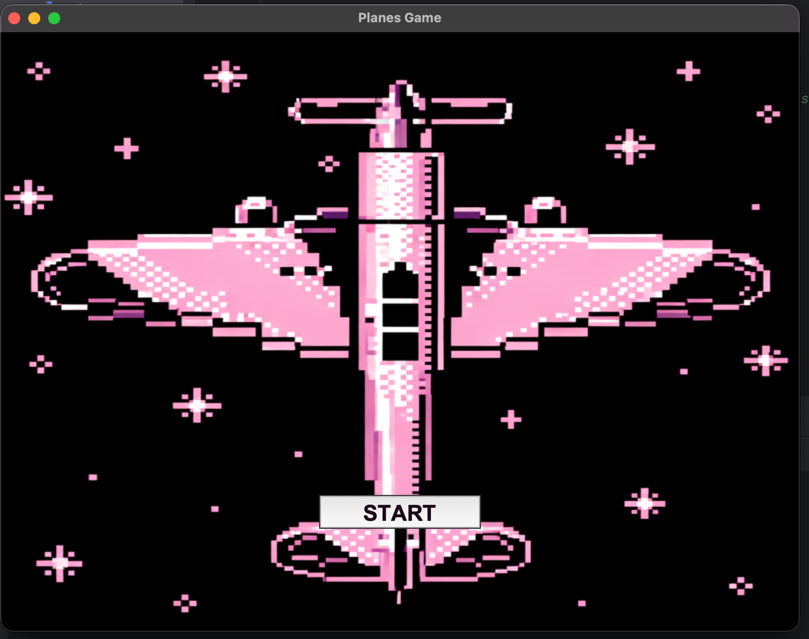
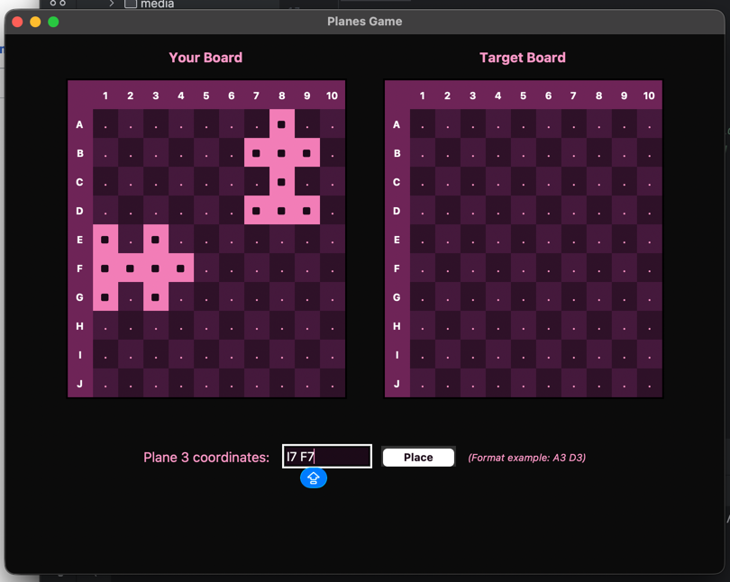
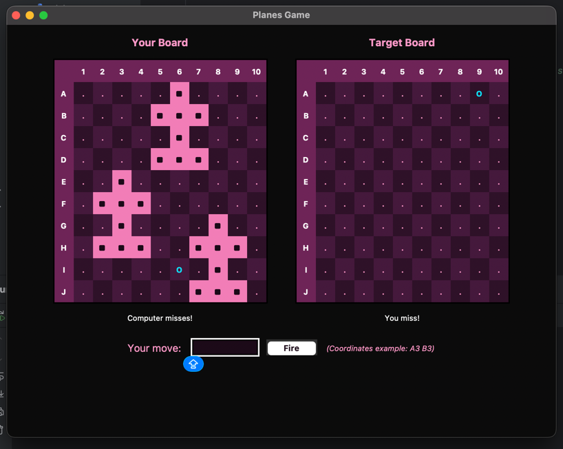
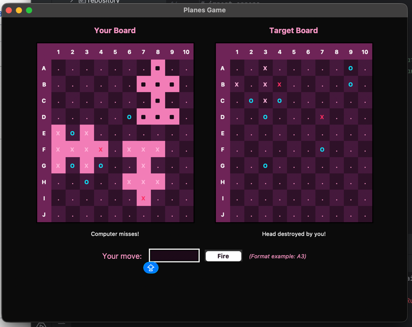
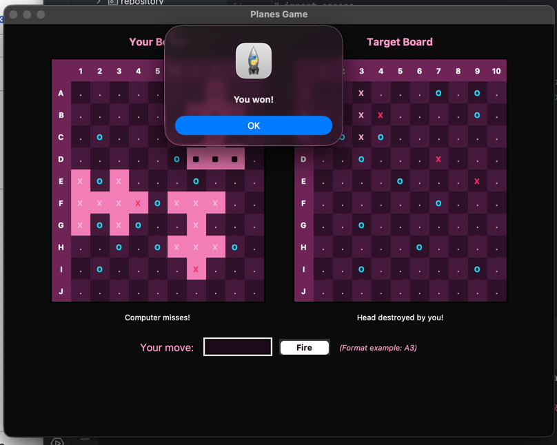

<div align="center">

<h1>Planes Game Application</h1>

<p>
  <strong>A Python strategy game built with layered architecture, custom computer AI, and dual user interfaces (Console and Tkinter GUI).</strong>
</p>

<br>

<p>
  
  
  
</p>

<p>
  
  
</p>

</div>

---

## Overview

This is an enhanced version of the Python Planes Game built for FP in my 1st semester of uni. **Planes Game** is a well-known turn-based strategy game. This app attempts to recreate it in a human player vs. computer player format. 

The application strictly satisfies all mandatory course requirements—including layered architecture, object-oriented design, PyUnit test coverage, and complete user input validation. Additionally, it achieves both project bonuses: a **dual Tkinter GUI interface** and a **custom target-tracking computer AI** tailored for hidden-information games.

## Demo

<table>
  <tr>
    <td align="center" width="50%">
      <strong>Launcher</strong><br>
      
    </td>
    <td align="center" width="50%">
      <strong>Placing the planes</strong><br>
      
    </td>
  </tr>
  <tr>
    <td align="center">
      <strong>Active Gameplay Grid</strong><br>
      
    </td>
    <td align="center">
      <strong>Hit & Miss Tracking</strong><br>
      
    </td>
  </tr>
  <tr>
    <td align="center">
      <strong>Plane Head Destruction</strong><br>
      
    </td>
    <td align="center">
      <strong>Game Over</strong><br>
      
    </td>
  </tr>
</table>

## Requirements and Implementation

### Assignment Requirements

* **Object-Oriented Programming & Layered Architecture**: Clear separation of concerns across Domain, Repository, Service, Validation, and UI modules
* **Testing**: Specifications and PyUnit test cases for all non-trivial methods outside the UI layer
* **Human vs. Computer Play**: Full turn-based gameplay allowing a human player to compete against a (moderately :)) engaging computer opponent
* **Input Protection**: Robust validation protecting the application against user syntax errors, duplicate coordinates, out-of-bounds placements, or plane overlaps.

### GUI Bonus

* **Dual User Interfaces**: Supports both a menu-based Console UI and a graphical user interface (Tkinter GUI)
* **Shared Program Layers**: Both console and GUI interfaces share the exact same underlying service, repository, and validation layers
* **Seamless Selection**: The application launcher allows starting the game in either UI mode effortlessly (chosen inside the console)

### AI Bonus — Heuristic Target & Pattern AI

Although the initial requirement was to use a **minimax algorithm**, this strategy cannot be directly applied to Planes because it is a game of **imperfect information** (similar to Battleship) where opponent positions are hidden. To meet the bonus specification of providing an entertaining opponent, the computer player employs a dynamic heuristic strategy that I classified in the following way:

1. **Target Pursuit Mode (Neighbour Tracking)**: Upon hitting a plane segment, the AI enqueues the four orthogonal adjacent cells (`_add_neighbours`) to systematically search for the rest of the aircraft..
2. **Pattern Matching and Head Guessing (`_guess_head_from_hits`)**: When consecutive hit lines are detected (`XXX` horizontally or vertically), the AI analyzes the geometric shape of planes to project candidate head coordinates ahead of time
3. **Head Elimination and Queue Clearing**: Hitting a plane head destroys the entire aircraft instantly. Upon a head hit, the AI wipes its pending target queue, registers the entire plane as destroyed, and pauses head-guessing for one turn to re-evaluate the board state.
4. **Fallback Exploration**: When no active targets or recognizable hit patterns exist, the computer reverts to probing untried random coordinates.

## Architecture

The project follows a **Layered Architecture**:

```text
├── domain/        # Board entities
├── repository/    # Board state tracking, hit/miss sets, plane placements
├── service/       # Game mechanics, placement validation, computer AI logic
├── validation/    # Input coordinate checks (A1-J10 syntax validation)
├── ui/            # ConsoleUI & Tkinter ConsoleGUI implementations
└── main.py        # Main entry point for launcher selection
