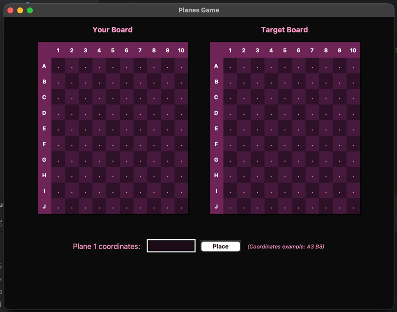
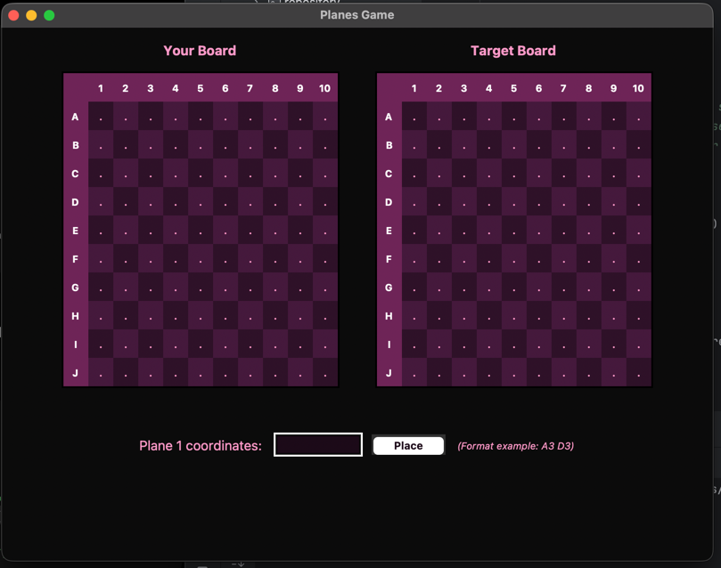

<div align="center">

<h1>Planes Game Application</h1>

<p>
  <strong>A Python desktop strategy game built with layered architecture, custom computer AI, and dual user interfaces (Console and Tkinter GUI).</strong>
</p>

<br>

<p>
  
  
  
</p>

<p>
  
  
</p>

</div>

---

## Overview

Developed as part of the **Fundamentals of Programming** course (Assignment 11 - Let's play), **Planes Game** is a turn-based human player vs. computer player strategy game implemented in Python. Played on an 11x11 grid, the game requires players to place aircraft and strategically locate and destroy all 3 opponent plane heads before their own are destroyed.

The application strictly satisfies all mandatory course requirements—including layered architecture, object-oriented design, PyUnit test coverage, and complete user input validation. Additionally, it achieves both project bonuses: a dual Tkinter GUI interface and a custom target-tracking computer AI tailored for hidden-information games[cite: 11, 12].

## Demo

<table>
  <tr>
    <td align="center" width="50%">
      <strong>Main Menu / Launcher</strong><br>
      
    </td>
    <td align="center" width="50%">
      <strong>Plane Placement Setup</strong><br>
      
    </td>
  </tr>
  <tr>
    <td align="center">
      <strong>Active Gameplay Grid</strong><br>
      
    </td>
    <td align="center">
      <strong>Hit & Miss Tracking</strong><br>
      
    </td>
  </tr>
  <tr>
    <td align="center">
      <strong>Plane Head Destruction</strong><br>
      
    </td>
    <td align="center">
      <strong>Game Over / Victory Screen</strong><br>
      
    </td>
  </tr>
</table>

## Requirements and Implementation

### Assignment Requirements

* **Object-Oriented Programming & Layered Architecture**: Clear separation of concerns across Domain, Repository, Service, Validation, and UI modules[cite: 11, 12, 13, 14].
* **Testing**: Specifications and PyUnit test cases for all non-trivial methods outside the UI layer[cite: 11].
* **Human vs. Computer Play**: Full turn-based gameplay allowing a human player to compete against an automated computer opponent[cite: 11, 12].
* **Input Protection**: Robust validation protecting the application against user syntax errors, duplicate coordinates, out-of-bounds placements, or plane overlaps.

### GUI Bonus (0.2P)

* **Dual User Interfaces**: Supports both a menu-based Console UI and a graphical user interface (Tkinter GUI)[cite: 11, 14].
* **Shared Program Layers**: Both console and GUI interfaces share the exact same underlying service, repository, and validation layers[cite: 11, 12, 13, 14].
* **Seamless Selection**: The application launcher allows starting the game in either UI mode effortlessly[cite: 11].

### AI Bonus (0.2P) — Heuristic Target & Pattern AI

Standard minimax search cannot be directly applied to Planes because it is a game of **imperfect information** (similar to Battleship) where opponent positions are hidden[cite: 11, 12]. To meet the bonus specification of providing a competitive, entertaining opponent[cite: 11], the computer player employs a dynamic heuristic strategy operating across three distinct modes[cite: 12]:

1. **Target Pursuit Mode (Neighbour Tracking)**: Upon hitting a plane segment, the AI enqueues the four orthogonal adjacent cells (`_add_neighbours`) to systematically search for the rest of the aircraft[cite: 12].
2. **Pattern Matching & Head Guessing (`_guess_head_from_hits`)**: When consecutive hit lines are detected (`XXX` horizontally or vertically), the AI analyzes the geometric shape of planes to project candidate head coordinates ahead of time[cite: 12].
3. **Head Elimination & Queue Clearing**: Hitting a plane head destroys the entire aircraft instantly[cite: 12]. Upon a head hit, the AI wipes its pending target queue, registers the entire plane as destroyed, and pauses head-guessing for one turn to re-evaluate the board state[cite: 12].
4. **Fallback Exploration**: When no active targets or recognizable hit patterns exist, the computer reverts to probing untried random coordinates[cite: 12].

## Architecture

The project strictly follows a **Layered Architecture**[cite: 11]:

```text
├── domain/        # Board entities, cell states, and grid representations
├── repository/    # Board state tracking, hit/miss sets, plane placements
├── service/       # Game mechanics, placement validation, computer AI logic
├── validation/    # Input coordinate checks (A1-J10 syntax validation)
├── ui/            # ConsoleUI & Tkinter ConsoleGUI implementations
└── main.py        # Main entry point for launcher selection
